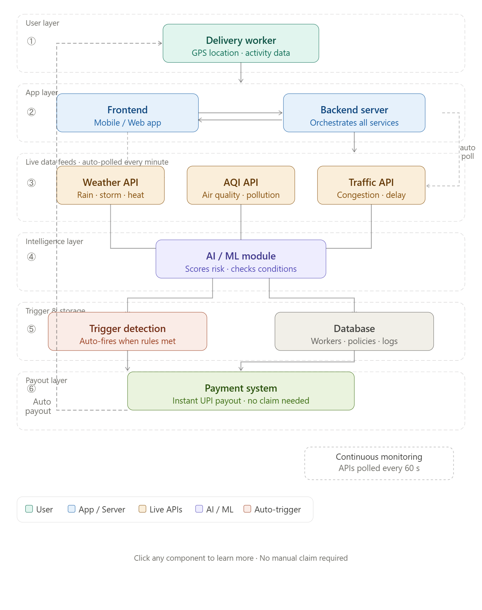

# AI-GigWorkerInsurance
# AI-Based Parametric Insurance for Delivery Workers
## 1. Problem Statement
In today's fast-growing economy, delivery partners working with platforms like Zomato, Swiggy, and Zepto play a very important role. Their daily income completely depends on the number of deliveries they complete. 
However, their work is highly affected by external factors such as heavy rain, extreme heat, and heavy traffic. During such conditions, they either cannot work efficiently or have to stop working for safety reasons.
As a result, they lose a significant portion of their income (around 20–30%), and currently, there is no system that compensates them for this loss. This makes their income unstable and uncertain.

## 2. Target Persona
Rahul is a 23 year Swiggy delivery partner who works in Hyderabad. He works for around 9 to 10 hours every day. Rahul earns between ₹700 and ₹900 each day based on the number of orders he completes. Rahul completes around 20 to 25 orders on days.However the Swiggy delivery partner Rahul faces problems when the weather is bad.

- When it rains heavily Swiggy delivery partner Rahul does not like to ride his bike.

- When the temperature is, above 40°C, Swiggy delivery partner Rahul takes breaks in between his work.

- When the pollution is high Swiggy delivery partner Rahul finds it hard to work for hours.

Because of these problems Swiggy delivery partner Rahul loses some of his earnings. Swiggy delivery partner Rahul does not have any insurance or any other way to get help.

## 4. Proposed Solution

The proposed system will be an AI-based parametric insurance system, and it will be tailored to the needs of delivery workers. The system will monitor conditions outside the worker, such as the weather and traffic. In turn, this will automatically trigger a payment to the worker upon the satisfaction of certain conditions.

This will ensure timely and convenient payment without the need for paperwork.

## 5. Weekly Pricing Model

The plans are designed to be affordable for delivery workers:

- Basic Plan: ₹20 per week → payout up to ₹300  
- Standard Plan: ₹40 per week → payout up to ₹700  
- Premium Plan: ₹70 per week → payout up to ₹1200  

The premium may vary slightly depending on the risk level of the area.

## 6. Parametric Triggers

The system utilizes predetermined environmental conditions to initiate the payment process automatically. The conditions include:

- Heavy Rainfall (>50mm)  
- Extreme Heat (>40°C)  
- High Air Pollution (>AQI 300)  

In the event of the occurrence of any of these conditions, the system will recognize the disruption and initiate the payment process.

## 7. AI/ML Integration

AI is used in the system in the following ways:

**Risk Assessment:**  
The system analyzes past environmental data to determine whether an area is low, medium, or high risk.

**Dynamic Pricing:**  
Premium amounts are adjusted based on the risk level of the user’s working location.

**Fraud Detection:**  
- Verifies user location using GPS  
- Matches weather data with claims  
- Prevents duplicate or false claims

## 8. Workflow

1. The user registers on the platform 
2. Selects a weekly insurance plan 
3. The system continuously monitors:
 - Weather conditions 
 - Pollution levels 
 - User location 
4. If a trigger condition is detected:
 - The system automatically identifies the event 
 - A claim is generated instantly 
 - The payout is credited to the user

## 9. Tech Stack

- Frontend: HTML / React  
- Backend: Node.js / Python  
- Database: Firebase / MongoDB  

- APIs:
  - OpenWeather API (for weather data)  
  - AQI API (for pollution levels)  
  - Traffic API (Google Maps API or simulated data)  

- AI/ML:
  - Basic predictive model for risk assessment  
  - Rule-based system for parametric trigger detection  
  - Anomaly detection for fraud prevention  

- Payment Integration:
  - Razorpay (or simulated payment system)  

- Other Tools:
  - GitHub (version control)  
  - Postman (API testing)
  - 
 ## 10. System Architecture
 
The diagram below shows how the system automatically detects disruptions and processes payouts.

